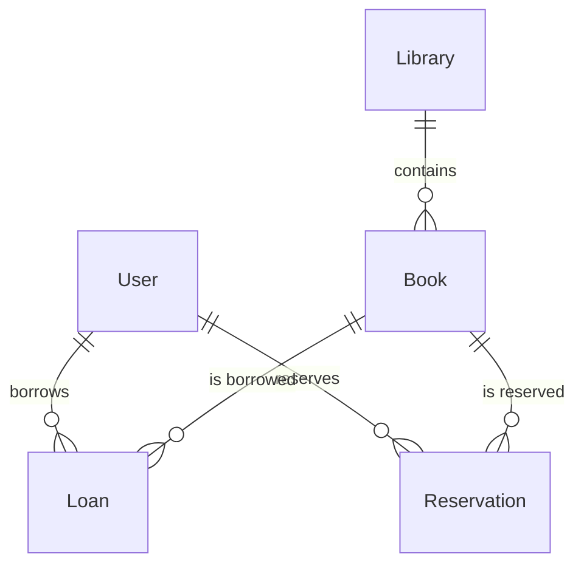

# 백엔드 프로젝트 아키텍처 분석 보고서

## 목차
1. [분석 개요](#분석-개요)
2. [아키텍처 개요](#아키텍처-개요)
3. [계층 구조 분석](#계층-구조-분석)
4. [도메인 모델 분석](#도메인-모델-분석)
5. [주요 아키텍처 문제점](#주요-아키텍처-문제점)
6. [설계 품질 평가](#설계-품질-평가)
7. [개선 권장사항](#개선-권장사항)

---

## 분석 개요

**분석 대상**: 도서관 관리 시스템 백엔드  
**아키텍처 스타일**: Layered Architecture (계층형 아키텍처)  
**기술 스택**: Spring Boot + Kotlin + JPA + PostgreSQL  
**분석 기준**: SOLID 원칙, 확장성, 유지보수성, 테스트 용이성

---

## 아키텍처 개요

### 전체 구조
```
┌─────────────────────────────────────────┐
│           Presentation Layer            │
│        (Controller Package)             │
├─────────────────────────────────────────┤
│            Business Layer               │
│         (Service Package)               │
├─────────────────────────────────────────┤
│         Data Access Layer               │
│        (Repository Package)             │
├─────────────────────────────────────────┤
│            Data Layer                   │
│         (Entity Package)                │
└─────────────────────────────────────────┘
```

### 도메인 구조
- **book**: 도서 관리 도메인
- **library**: 도서관 관리 도메인  
- **loan**: 대출 관리 도메인
- **reservation**: 예약 관리 도메인
- **user**: 사용자 관리 도메인
- **common**: 공통 기능 (보안, 응답 형식)

---

## 계층 구조 분석

### 1. Presentation Layer (Controller) ✅ **양호**

**파일 예시**:
- `BookController.kt`
- `LoanController.kt`
- `ReservationController.kt`

**장점**:
```kotlin
@RestController
@RequestMapping("/api/books")
class BookController(
    private val bookService: BookService
) {
    // RESTful API 설계 준수
    // 의존성 주입 적절히 사용
    // 일관된 응답 구조 (ApiResponse)
}
```

**문제점**:
- 반복적인 예외 처리 코드
- 입력 검증 로직 부족

### 2. Business Layer (Service) ⚠️ **개선 필요**

**파일 예시**:
- `BookService.kt`
- `LoanService.kt`
- `ReservationService.kt`

**장점**:
```kotlin
@Service
@Transactional
class BookService(
    private val bookRepository: BookRepository,
    private val libraryRepository: LibraryRepository
) {
    // 트랜잭션 관리 적절
    // 비즈니스 로직 중앙화
}
```

**문제점**:
```kotlin
// 도메인 간 직접 의존성
class ReservationService(
    private val reservationRepository: ReservationRepository,
    private val bookRepository: BookRepository,  // 다른 도메인 직접 참조
    private val userRepository: UserRepository,  // 다른 도메인 직접 참조
    private val loanRepository: LoanRepository   // 다른 도메인 직접 참조
)
```

### 3. Data Access Layer (Repository) ✅ **양호**

**파일 예시**:
- `BookRepository.kt`
- `LoanRepository.kt`

**장점**:
```kotlin
@Repository
interface BookRepository : JpaRepository<Book, Long> {
    // Spring Data JPA 활용
    // 메서드 명명 규칙 준수
    // 커스텀 쿼리 적절히 사용
    
    @Query("SELECT b FROM Book b WHERE b.availableCopies > 0")
    fun findAvailableBooks(): List<Book>
}
```

### 4. Data Layer (Entity) ⚠️ **개선 필요**

**장점**:
```kotlin
@Entity
@Table(name = "books")
data class Book(
    @ManyToOne(fetch = FetchType.LAZY)  // 지연 로딩 사용
    @JoinColumn(name = "library_id")
    val library: Library
    // 적절한 데이터베이스 매핑
)
```

**문제점**:
- 비즈니스 로직이 엔티티에 없음 (빈약한 도메인 모델)

---

## 도메인 모델 분석

### 엔티티 관계도


### 관계 설계 평가

**✅ 올바른 설계**:
```kotlin
// 적절한 연관관계 설정
@ManyToOne(fetch = FetchType.LAZY)
@JoinColumn(name = "library_id", nullable = false)
val library: Library
```

**⚠️ 문제 있는 설계**:
```kotlin
// 도메인 로직이 서비스에만 존재
data class Book(
    val totalCopies: Int = 1,
    val availableCopies: Int = 1
    // 대출 가능 여부 확인 로직이 엔티티에 없음
)
```

---

## 주요 아키텍처 문제점

### 1. 순환 참조 위험 🔴 **위험도: 높음**

**문제점**:
```kotlin
// ReservationService.kt
class ReservationService(
    private val loanRepository: LoanRepository  // Loan 도메인 참조
)

// LoanService.kt  
class LoanService(
    private val bookRepository: BookRepository  // Book 도메인 참조
)

// BookService.kt
// 만약 ReservationRepository 참조 시 순환 참조 발생 가능
```

**영향**: 의존성 주입 실패, 런타임 에러

### 2. 전역 예외 처리 부재 🟡 **위험도: 보통**

**문제점**:
```kotlin
// 각 Controller마다 동일한 예외 처리 반복
@PostMapping
fun createLoan(@RequestBody request: LoanCreateRequestDto): ResponseEntity<ApiResponse<LoanResponseDto>> {
    return try {
        val loan = loanService.createLoan(request)
        ResponseEntity.ok(ApiResponse.success(loan, "성공"))
    } catch (e: IllegalArgumentException) {
        ResponseEntity.badRequest().body(ApiResponse.error(e.message ?: "실패"))
    } catch (e: IllegalStateException) {
        ResponseEntity.badRequest().body(ApiResponse.error(e.message ?: "실패"))
    } catch (e: Exception) {
        ResponseEntity.internalServerError().body(ApiResponse.error("오류"))
    }
}
```

**영향**: 코드 중복, 일관성 없는 에러 처리

### 3. 빈약한 도메인 모델 🟡 **위험도: 보통**

**문제점**:
```kotlin
// Entity에 비즈니스 로직 없음
data class Book(
    val availableCopies: Int = 1,
    val totalCopies: Int = 1
    // 대출 가능 여부 확인 메서드 없음
)

// 비즈니스 로직이 서비스에 집중
class BookService {
    fun borrowBook(id: Long): BookResponseDto {
        if (book.availableCopies <= 0) {  // 로직이 서비스에 있음
            throw IllegalStateException("대여 가능한 도서가 없습니다")
        }
    }
}
```

**영향**: 도메인 지식 분산, 중복 로직 발생 가능

### 4. 강한 도메인 간 결합 🟡 **위험도: 보통**

**문제점**:
```kotlin
// ReservationService가 여러 도메인에 직접 의존
class ReservationService(
    private val reservationRepository: ReservationRepository,
    private val bookRepository: BookRepository,      // Book 도메인
    private val userRepository: UserRepository,      // User 도메인  
    private val loanRepository: LoanRepository       // Loan 도메인
)
```

**영향**: 변경 영향도 증가, 테스트 복잡성 증가

### 5. 비일관적 데이터 상태 관리 🟡 **위험도: 보통**

**문제점**:
```kotlin
// LoanService에서 Book 상태 직접 변경
private fun updateBookAvailableCopies(bookId: Long, change: Int) {
    val book = bookRepository.findById(bookId)
    val updatedBook = book.copy(availableCopies = book.availableCopies + change)
    bookRepository.save(updatedBook)  // 다른 도메인 데이터 직접 수정
}
```

**영향**: 데이터 일관성 문제, 트랜잭션 경계 모호

### 6. 확장성 부족 🟢 **위험도: 낮음**

**문제점**:
- 페이징 처리 미적용
- 캐싱 전략 부재
- 비동기 처리 고려 안됨

---

## 설계 품질 평가

### SOLID 원칙 준수도

| 원칙 | 평가 | 설명 |
|------|------|------|
| **S**RP | ⚠️ 부분적 | 서비스 클래스가 여러 책임을 가짐 |
| **O**CP | ❌ 미흡 | 확장에 대한 고려 부족 |
| **L**SP | ✅ 양호 | 인터페이스 활용 적절 |
| **I**SP | ✅ 양호 | 인터페이스 분리 적절 |
| **D**IP | ⚠️ 부분적 | 구체 클래스 의존성 일부 존재 |

### 품질 속성 평가

| 속성 | 점수 | 평가 |
|------|------|------|
| **유지보수성** | 6/10 | 코드 중복, 강한 결합 |
| **확장성** | 5/10 | 계층 구조는 좋으나 도메인 간 결합 |
| **테스트 용이성** | 5/10 | 의존성 주입은 좋으나 복잡한 의존성 |
| **성능** | 6/10 | 기본적인 최적화는 있음 |
| **안정성** | 4/10 | 예외 처리 일관성 부족 |

---

## 개선 권장사항

### 1단계: 즉시 개선 (긴급)

#### 1.1 전역 예외 처리 추가
```kotlin
@RestControllerAdvice
class GlobalExceptionHandler {
    
    @ExceptionHandler(IllegalArgumentException::class)
    fun handleIllegalArgument(e: IllegalArgumentException): ResponseEntity<ApiResponse<Nothing>> {
        return ResponseEntity.badRequest().body(
            ApiResponse.error(e.message ?: "잘못된 요청입니다")
        )
    }
    
    @ExceptionHandler(IllegalStateException::class)
    fun handleIllegalState(e: IllegalStateException): ResponseEntity<ApiResponse<Nothing>> {
        return ResponseEntity.badRequest().body(
            ApiResponse.error(e.message ?: "처리할 수 없는 상태입니다")
        )
    }
}
```

#### 1.2 도메인 이벤트 도입
```kotlin
// 도메인 간 결합 완화
@Component
class BookLoanEventHandler {
    
    @EventListener
    fun handleBookBorrowed(event: BookBorrowedEvent) {
        // 예약 상태 업데이트 등
    }
}
```

### 2단계: 구조 개선 (중요)

#### 2.1 도메인 서비스 분리
```kotlin
// 도메인별 서비스 분리
@Service
class BookDomainService(
    private val bookRepository: BookRepository
) {
    fun canBorrow(bookId: Long): Boolean {
        // 도서 대출 가능 여부만 확인
    }
}

@Service  
class LoanApplicationService(
    private val loanRepository: LoanRepository,
    private val bookDomainService: BookDomainService  // 도메인 서비스 의존
) {
    // 애플리케이션 로직만 담당
}
```

#### 2.2 풍부한 도메인 모델 적용
```kotlin
@Entity
data class Book(
    val totalCopies: Int = 1,
    val availableCopies: Int = 1
) {
    fun canBorrow(): Boolean {
        return availableCopies > 0 && status == BookStatus.AVAILABLE
    }
    
    fun borrow(): Book {
        if (!canBorrow()) {
            throw IllegalStateException("대출할 수 없는 도서입니다")
        }
        return this.copy(availableCopies = availableCopies - 1)
    }
}
```

### 3단계: 장기 개선 (권장)

#### 3.1 CQRS 패턴 적용
```kotlin
// Command와 Query 분리
interface BookCommandService {
    fun createBook(command: CreateBookCommand): BookId
    fun borrowBook(command: BorrowBookCommand): BookId
}

interface BookQueryService {
    fun findById(id: BookId): BookView?
    fun findAvailableBooks(): List<BookView>
}
```

#### 3.2 헥사고날 아키텍처 적용
```kotlin
// 포트와 어댑터 패턴
interface BookRepository {  // 포트
    fun save(book: Book): Book
    fun findById(id: BookId): Book?
}

@Component
class JpaBookRepository : BookRepository {  // 어댑터
    // JPA 구현
}
```

### 개선 체크리스트

#### 즉시 개선
- [ ] 전역 예외 처리 핸들러 추가
- [ ] 중복 예외 처리 코드 제거
- [ ] 입력 검증 강화
- [ ] 로깅 전략 수립

#### 구조 개선
- [ ] 도메인 서비스 분리
- [ ] 도메인 이벤트 도입
- [ ] 풍부한 도메인 모델 적용
- [ ] 의존성 역전 적용

#### 장기 개선
- [ ] CQRS 패턴 적용
- [ ] 이벤트 소싱 고려
- [ ] 마이크로서비스 전환 검토
- [ ] 캐싱 전략 수립

---

**분석 완료 일시**: 2024년 현재  
**다음 검토 권장**: 구조 개선 사항 적용 후 재검토 